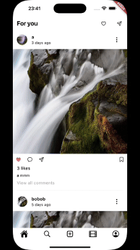

# Instagram Clone Flutter

Welcome to the **Instagram Clone Flutter** project! 🎉
This project is your gateway to creating an Instagram-like app using Flutter.

### Installation
_Before you dive in, make sure you have Flutter installed. If not, you can find the installation guide [here](https://flutter.dev/docs/get-started/install)._

1. Clone the repo to your local machine using Git.
2. Navigate to the project directory:
3. Run the app:
   ```sh
   flutter run
   ```
4. Build the app:
   ```sh
    flutter build apk
   //  or
    flutter build ios
    ```
5. Enjoy your Instagram Clone Flutter app! 🚀

## Features

### Authentication
- [x] Sign Up
- [x] Log In
- [x] Log Out


### Profile
- [x] View Profile
- [x] Follow/Unfollow Users
- [ ] Edit Profile



### Home
- [x] View Posts
- [x] Like/Unlike Posts
- [x] Comment on Posts


### Search
- [x] Search for Users


### Reels
- [x] View Reels


## Contributing
If you have any ideas on how to improve the app, feel free to contribute! To do so, follow these steps:

1. Fork the project
2. Create your feature branch (`git checkout -b feature/AmazingFeature`)
3. Commit your changes (`git commit -m 'Add some AmazingFeature'`)
4. Create a pull request to the `main` branch of the original project.

## License
Distributed under the MIT License. See `LICENSE` for more information.
